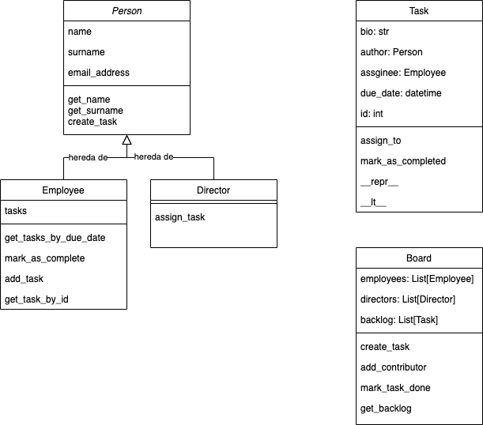

# Guía de resolución.

El siguiente documento plantea una serie de pasos y ejercicios mentales
que ayudan en la resolución de problemas utilizando el paradigma de objetos.

## Paso 1: Análsis de entidades.
Como es usual en todo ámbito de resolución de problemas, primero debemos prestar suma atención
al enunciado provisto. En este caso, debemos primero analizar cuales son los actores del problema 
(quienes son entidades propias que interactuan o deben interactuar en el problema). 

De hacer foco en este punto, salen los siguientes actores:
- `mimebro del equipo de marketin` (quien ejecuta las tareas)
- `directivo` (quien determina las tareas)
- `tablero` (donde viven las tareas con sus subdivisiones)
- `notitas` (como se expresan las tareas)
  
Es importante entender que las entidades no tiene porque ser siempre ojetos animados, pueden ser
herramientas que influyen en el problema. En nuestro caso, el tablero y las notitas son simples 
herramientas que forman parte del problema a resolver y que deben tener un modelado dentor del mismo.
Usualmente, la mejor forma de encontrar estas entidades es buscar que personas o cosas tiene estados 
que nos interesan o realizan acciones que nos importan sobre el probelma a resolver.

## Paso 2: Análsis de comportamiento.
En este paso, intentamos encontrar las acciones que nuestro sistema debe representar. No necesariamente 
vamos a pensar en quien las debe realizar, sino que deben estar implementadas en nuestro programa.

Comportamientos esperados:
- Debe poder agregar tareas
- Un directivo debe poderasignar tareas
- Un mimebro del equipo debe ver sus tareas pendientes en orden de vencimiento
- Un miembro del equipo debe poder finalizar su tarea
- El estado del tablero no debe perderse en caso de que se apague la computadora.

En esta lista veremos que ciertos comportamientos tiene naturalmente una entidad asignada, pero ciertos
otros no. Eso es esperable y usualmente proviene del simple hecho que un comportamiento puede involucrar a más
de una entidad. Nuestra tarea en subdividir dichos comportamientos en las responabilidades de cada entidad.

`Debe poder agregar tareas`: Este comporamiento no queda definido del todo, dado que no sabemos quien puede agregar 
una tarea como así tampoco sabemos donde se agrega. Para intentar definir mejor esto, primero veamos las entidades que 
definimos. Si pensamos en el problema, las tareas del equipo son las pequeñas acciones que cada individuo debe tomar para
lograr cada uno de los objetivos planteados por el directivo. Esto implica que cualquier miembro del equipo debe ser capaz
de generar tareas, dado que las mismas son sub divisiones del objetivo más grande. Sin ir más lejos, pensando en los trabajos 
prácticos grupales que ustedes hacen, verán que la sub división de esas tareas es una actividad que practican entre todos los 
integrantes. Ahora bien, dichas tareas generadas deben quedar explicitadas en algún lugar que es común para todos. Aquí es 
donde entra en escena el `tablero`, dicho tablero es quien matiene el estado de las tareas y todo lo que ellos signifique. 
Entonces, para generar una tarea se requiere una persona que indique al tablero que desea generar una nueva tarea. La misma 
por default no tiene una persona asignada dado que eso es responsabilidad del directivo.

`El estado del tablero no debe perderse en caso de que se apague la computadora`: Este comportamiento es un poco más engañoso. 
Dado que escencialmente no es un comportamiento en sí, pero es una característica esperada del sistema lo cual implica un 
comportamiento del mismo. Básicamente, lo que nos están pidiendo es que el estado del tablero pueda ser persistido en algún luagr 
tal que si se apaga el programa el estado no se pierda. Para lograr esto, tenemos que pensar en que herramienta conocemos que logre 
persistir datos aún cuando un programa termina, rápidamente recordamos que existen los "archivos" que siguen existiendo aún cuando 
reiniciamos una computadora. Entonces, lo que debemos lograr es que nuestro programa tenga la forma de guardar su estado actual 
en un archivo y volver a un estado dado un archivo.

## Paso 3: Modelado.
Este es uno de los pasos más característicos y escenciales de la programación orientada a objetos. Involucra la creación de objetos
representando sus estados internos y métodos esperados de ellos. El modelado de objetos se puede realiza de muchas formas, la más 
recomendable es a la vieja escuela en lápiz y papel utilizando los conceptos de UML (Unified Modeling Language). Dado que conozco a
mis alumnos y pocos utilizaran esta técnica, lo mínimo que les pido es que utilicen un motor gráfico como Lucid Chart o DrawIO para 
generar 2 diagramas. El primero, llamado "diagrama de relación" es donde ponemos los nombres de cada objetos que existe en nuestro sistema
y simplemente los conectamos con flechas para explicitar que los mismo se relacionan entre si por medio de algún método (uno llama a \
un método del otro o accede a un estado). El segundo, llamado "diagrama de entidades" es donde armamos cajas con los cada objeto que vamos a armar
luego pensamos en que métodos debe tener el mismo para responder a las interacciones que planteamos en el "diagrama de relación" y finalmente
planteamos que variables debemos tener internamente en cada objeto para poder mantener hacer dichos métodos. 

Luego de nuestro modelado, obtendremos algo como lo siguiente.

## Paso 4: Implementación.
Empezamos por implementar los objetos que modelamos previamente, con frencuencia en este punto nos daremos cuenta de variables que faltan 
o métodos que no contemplamos que necesitaremos. Es algo normal y debemos simplemente añadir estos nuevos cambios al diseño anterior.

Luego de horas de intentar buscar en Google o en este mismo repositorio como implementar las clases anteriores (y seguramente buscando como
se escriben o que significan ciertos comentarios de la resolución), seguramente comiencen a pensar "como vamos a tomar datos de quienes utilicen
el sistema". Este tipo de inquietudes, que están bien fundadas y son normales, no deben ser de su preocupación cuando piencen en el modelado de
una solución. El paradigma no contempla como obtenemos los datos de un usuario por linea de comando ni es algo que nos interes. Lo que nos interesa
es el paso una vez que obtenemos esos datos, de eso se trató el modelado del punto 3 y la primera parte de este punto. Ahora bien, como es que terminaremos utilizando estos objetos que creamos? La respuesta es: Falta modelar un objeto más. 

Normalmente, los sistemas que interactuan con un usuario final (como es nuestro caso) deben tener un objeto que sirve de interfaz entre los usuario
y nuestro sistema. En la solución pro puesta esta interfaz es la clase `Engine` la cual mantiene el estado del `Board` y es quien implementa la mayoria 
de los comportamientos que requiere un menu de usuario. Tomen las ideas de esta clase para futuras interacciones con usuarios, noten la diferenciación
(utilizando modulos separados o en su defento funciones separadas) entre la "lógica" de un comando y la interacción con el usuario (los inputs que esperamos).

## Paso 5: testing.

Una vez que tenemos un modelo funcional de lo que requerimos, es importante probar que su comportamiento es el esperado.
Utilicen el módulo `Pytest` para generar casos de testeo sobre comportamientos del sistema y así asegurarse que ciertas
partes del sistema funcionan como esperan. De esta forma, pueden tener un poco más de confianza en la robustez de su solución.

### Aclaraciones:
La solución propuesta se encuentra en la carpeta `solution`.
La misma contiene un archivo `main.py` el cual es el punto de ingreso al sistema.
en la carpeta `src` obtendran los módulos con la lógica implementada.

**Para correrlo**:
- Descargar el repositorio.
- abrir una terminal que parado dentro de la carpeta `solution`
- en la terinal ingresar `python main.py`

