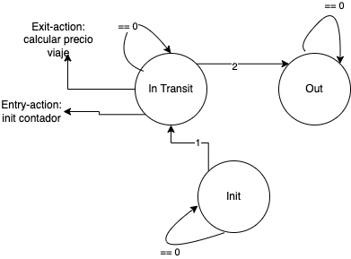

# State Machine

Las maquinas de estado son un concepto clave para la resolución de muchos problemas.
Su simpleza y facilidad para transmitir la resolución de un problema por fuera de 
las lineas de código que requirean lo hacen extremadamente útil.

A pesar de su simpleza, en el transcurso de la materia veremos que hay escenarios en los cuales
la implementación puede resultar compleja. Lo importante es entender los concepto básicos detrás
de la implementación.

## Concepto básico:
La máquina de estados finitos (Finite State Machine) es un concepto matemático que se utiliza para generar algoritmos de programación. 
En general, la misma se focaliza en problemas donde tenemos una secuencia de entradas para la cual el comportamiento de nuestro programa varia dependiedo del contexto. 

### cada estado requiere definir 3 aspectos:
-> **entry-action** : set de acciones al entrar al estado.
-> **exit-action** : set de acciones al salir del estado.
-> **transition-action** : set de acciones para cambiar de estado.

Si pensamos en un ejemplo más, analicemos el caso de un pasajero de subte.
La situación que deseamos mappear es la siguiente:

Nos piden escribir una función que calcule el precio del viaje de cada pasajero.
Dado que el recorridos de cada subte son de distinta longitud, recibimos una lista
donde figura `1` en la estación donde la persona accedió al transporte y un `2` en 
aquella estación donde descendió. Todas las demás entradas seran `0`.
Entonces, podemos pensar en el siguiente diagrama como sería el cambio de estados en una secuancia inicial.

Para este caso, definimos las acciones de transición como simplemente consumir el evento cuando cumpla la condición y solamente uno de los estados posee acciones de entrada y salida (dado que es el único de interés).

## Como Utilizar el concepto:
A la hora de ver un problema que contiene una secuencia de acciones, donde el contexto implique un cambio en como procesamos dicha secuencia, no encontramos frente a un caso de posible uso de Maquina de Estados.

1. Remarcar los posibles estados del problema, es posible que exista un estado "init" el cual representa el comienzo sin ser particularmente parte en si del problema. En situaciones donde la secuencia es ciclica el último punto toma mayor importancia.

2. Denotar los eventos que generan transiciones entre dichos estados. Anotar los mismos, incluyendo los "loops"

3. Finalmente escribir el código que represente nuestro algoritmo.

